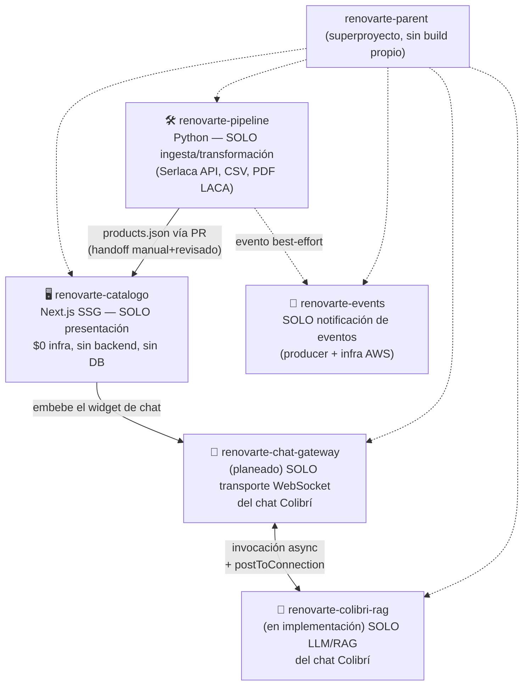
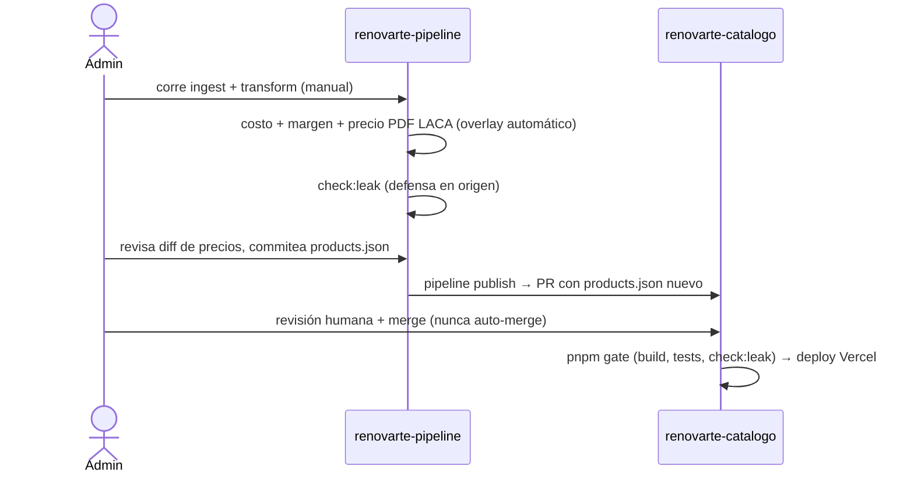
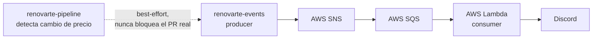
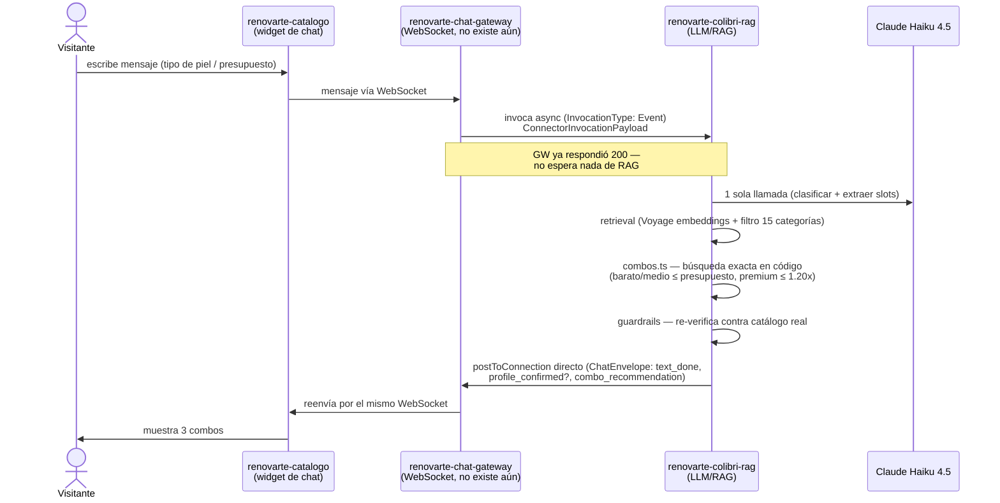
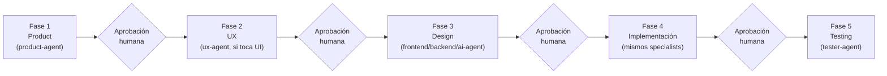

# Arquitectura general — RenovArte

Vista de conjunto de `renovarte-parent` y sus submódulos: qué repo hace qué,
cómo se comunican entre sí, y cómo se construye cada feature nueva. Para el
detalle línea a línea de un flujo puntual, ver los documentos dedicados:
[`flujo-event-driven-precios.md`](./flujo-event-driven-precios.md) (evento
de cambio de precio → Discord) y [`flujo-precio-pdf.md`](./flujo-precio-pdf.md)
(resolución de precio desde el PDF de LACA). Invariantes no negociables en
[`../specs/constitution.md`](../specs/constitution.md).

## Arquitectura general — 5 repos, una responsabilidad cada uno

Invariante que atraviesa todo (`specs/constitution.md` del root): **un repo,
una responsabilidad**; **$0 infra por defecto** salvo excepción explícita y
acotada (ej. el techo de USD 20/mes del chat, RNF-09); **ningún repo nuevo
invalida una invariante ya cerrada de otro** — por eso el chat no vive
dentro de `renovarte-catalogo` (que tiene cerrado "no runtime backend"),
sino en 2 repos nuevos separados.

## Flujo 1 — catálogo de productos (pipeline → catalogo)

## Flujo 2 — evento de cambio de precio → Discord (en producción)

Detalle completo con niveles de componentes y secuencia real verificada en
[`flujo-event-driven-precios.md`](./flujo-event-driven-precios.md).

## Flujo 3 — chat Colibrí (spec 0016, en implementación)

Puntos clave de este flujo (spec completa en
[`../specs/0016-chat-recomendador-cremas/spec.md`](../specs/0016-chat-recomendador-cremas/spec.md)):

- **Texto plantillado siempre**, salvo 1 sola llamada al modelo por turno —
  control de costo, RNF-09 (techo USD 20/mes).
- **Combos calculados en código** (`combos.ts`), nunca aritmética del LLM —
  garantía matemática de que "más barato"/"medio" ≤ presupuesto y "premium"
  ≤ presupuesto × 1.20.
- **Invocación asíncrona** porque API Gateway WebSocket tiene un límite de
  29s y una llamada a LLM (con eventual RAG) puede superarlo — si
  `renovarte-colibri-rag` falla, es responsable de avisarle al cliente
  directamente (no puede propagar la excepción a quien lo invocó).

## Flujo 4 — cómo se construye cada feature (gobierno del proyecto)

Regla dura en cada flecha `G`: nada avanza sin aprobación explícita —
silencio o un "ok" ambiguo no cuentan. Y dentro de cada fase de código:
rama dedicada siempre, PR siempre, nunca merge automático, aprobación
explícita antes de cada commit y cada push individual (no alcanza con
haber aprobado la tarea en general — ver
[`../CLAUDE.md`](../CLAUDE.md)).
