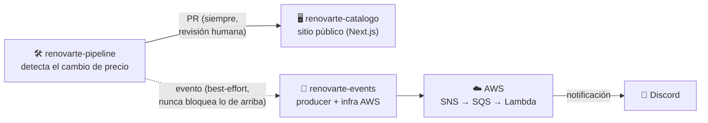
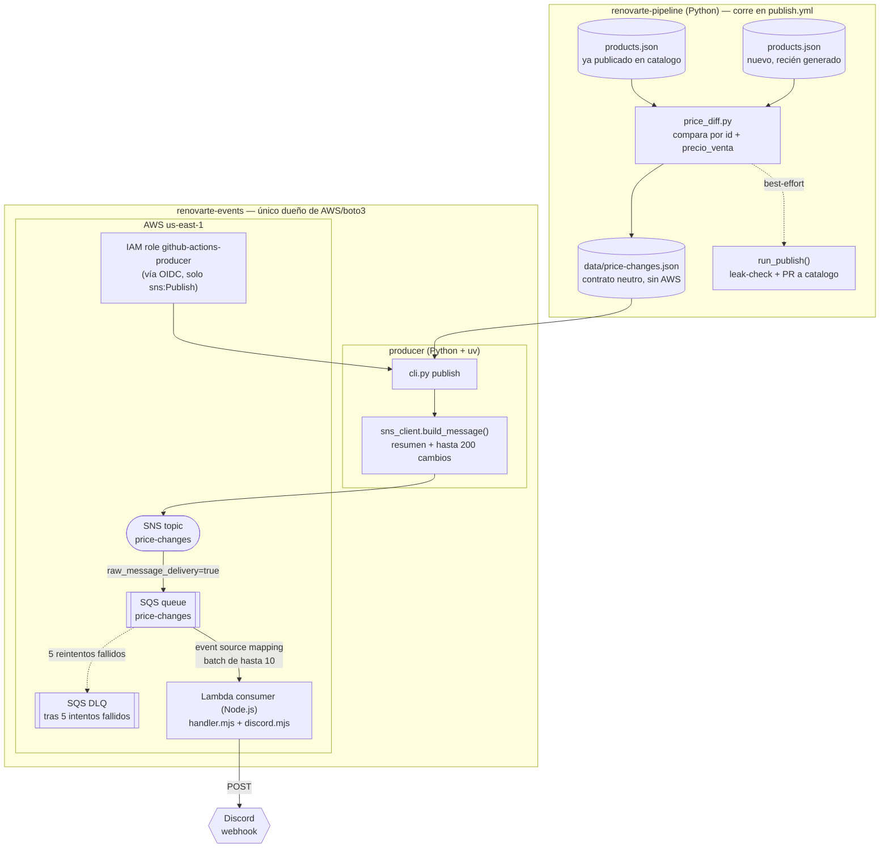
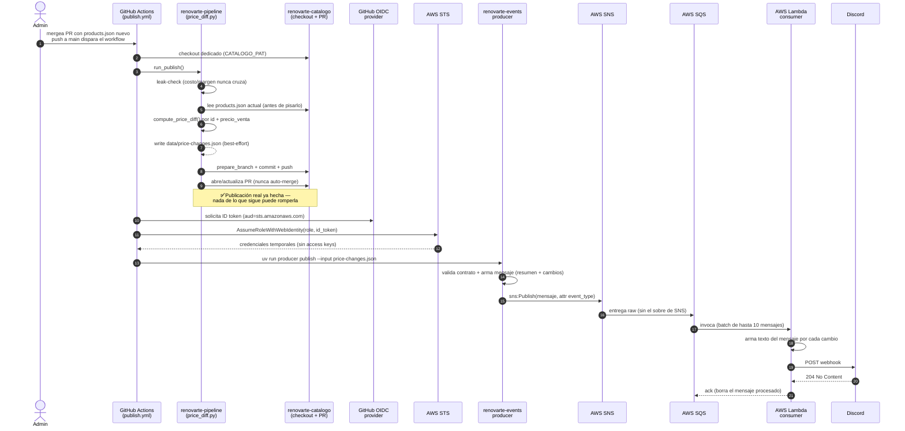
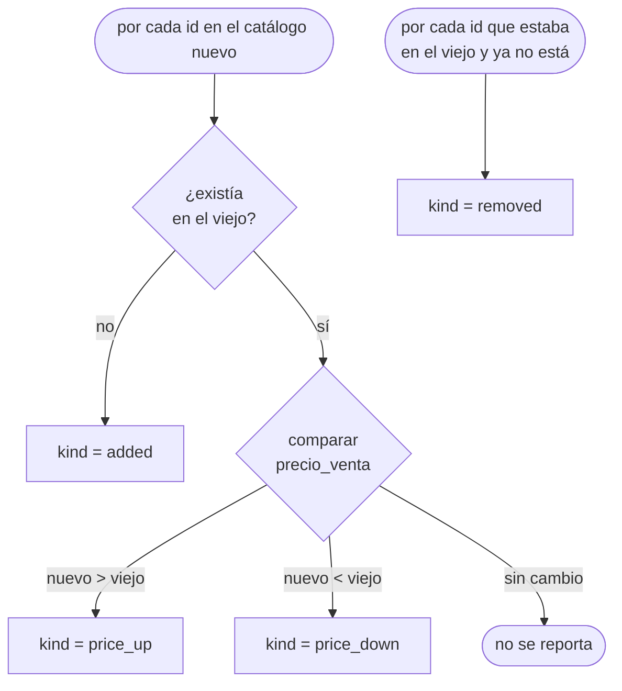

# Flujo: del cambio de precio a la notificación en Discord

Diagrama en distintos niveles de detalle del POC event-driven descrito en
[`PLAN-EVENTS.md`](../PLAN-EVENTS.md): desde que `renovarte-pipeline`
detecta un cambio de precio hasta que llega la notificación a Discord,
pasando por AWS (SNS → SQS → Lambda). El contrato de datos completo está en
[`renovarte-events/docs/evento-price-changes.md`](../renovarte-events/docs/evento-price-changes.md).

**Principio de diseño que atraviesa todo el flujo:** `renovarte-pipeline`
no sabe nada de AWS, y todo lo de AWS es **best-effort** — si cualquier
paso de acá falla, la publicación real del catálogo (el PR a
`renovarte-catalogo`) ya se hizo antes y nunca se ve afectada.

## Nivel 1 — Vista general

Los cuatro sistemas involucrados, sin detalle interno.

## Nivel 2 — Componentes

Qué vive en cada repo y qué recursos de AWS entran en juego (todos dentro
del "Always Free tier" al volumen de este proyecto).

## Nivel 3 — Secuencia real (una corrida de `publish.yml`)

Orden exacto de lo que pasa en CI, tal como se verificó en un run real
(ver `PLAN-EVENTS.md`, Fase 6).

## Nivel 4 — Cómo se clasifica cada cambio

Lógica de `compute_price_diff()` (`renovarte-pipeline/src/pipeline/publish/price_diff.py`).

## Notas de diseño

1. **Best-effort de punta a punta.** Cada paso del lado de AWS
   (`compute_price_diff`/`write_price_diff` en pipeline, y los 3 pasos
   nuevos en `publish.yml`) está envuelto en `try/except` o marcado
   `continue-on-error: true` — un fallo de AWS, Discord o red nunca tumba
   el job ni bloquea el PR real al catálogo.
2. **Sin credenciales de larga duración.** El producer se autentica en CI
   vía OIDC (`aws-actions/configure-aws-credentials` + `role-to-assume`),
   no con access keys guardadas como secret.
3. **Least-privilege en cada punto.** El rol que asume GitHub Actions solo
   puede `sns:Publish` sobre este topic puntual; el rol de la Lambda solo
   puede leer/borrar mensajes de su cola y escribir en su propio log group.
4. **Sin acoplamiento de código entre repos.** `renovarte-pipeline` y
   `renovarte-events` se comunican únicamente a través de
   `data/price-changes.json` (un contrato de datos versionado
   `schema_version`), igual que `renovarte-pipeline` y `renovarte-catalogo`
   ya se comunican vía `products.json`.
5. **Fallas parciales no reprocesan todo el batch.** Si Discord falla para
   un mensaje del batch, la Lambda reporta ese `messageId` en
   `batchItemFailures` — solo ese mensaje vuelve a la cola (y eventualmente
   a la DLQ tras 5 intentos), sin reprocesar los que ya se entregaron.
