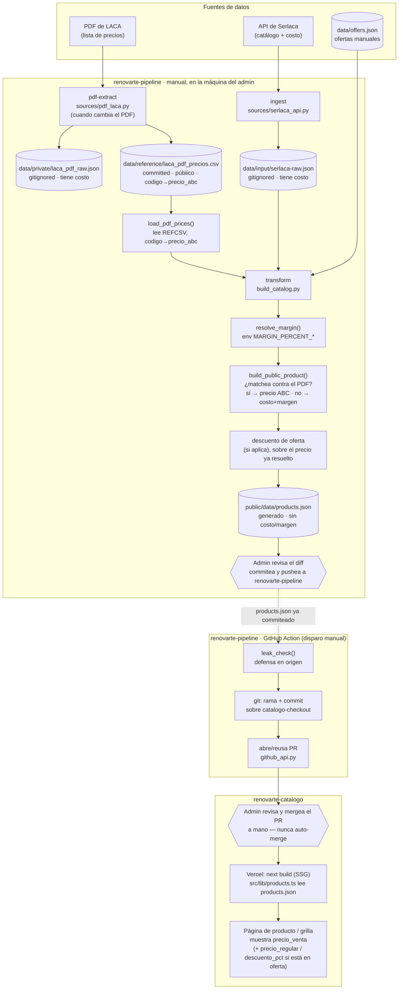

# Flujo: del PDF de LACA al precio en la página

Diagrama de todo el camino de datos, desde el PDF de precios de LACA hasta
el `precio_venta` que se ve en `renovarte-catalogo`. Para acompañar el
análisis de la Fase 2/3 del [`PLAN.md`](./PLAN.md).

**El PDF es la fuente primaria de precio, automática dentro de
`transform` — no hay revisión manual por producto.** El precio ABC del PDF
se aplica directo a todo código que matchea; sin match (o sin ABC en el
PDF) el producto sigue con costo+margen, igual que siempre. Nada
desaparece del catálogo por no estar en el PDF de un mes dado.

**`pdf-extract`, `ingest` y `transform` son siempre manuales**, corridos
por el admin en su máquina — la única pieza que corre en CI (GitHub
Actions) es `publish`, y solo toma el `public/data/products.json` que el
admin ya generó y commiteó en `renovarte-pipeline`.

## Puntos para analizar

1. **La Action no genera datos, solo publica** — `ingest`/`transform`/
   `pdf-extract` nunca corren en CI. Esto saca `SERLACA_API_KEY` y el resto
   de la config de Serlaca de los secrets de GitHub (solo hace falta local,
   en `.env.local`); la Action solo necesita `CATALOGO_PAT`.
2. **`publish` es siempre disparo manual, sin cron** — corre después de que
   el admin ya commiteó un `products.json` nuevo; si por algún motivo se
   dispara sin nada nuevo, detecta "sin cambios" y no hace nada.
3. **El precio del PDF se aplica antes del descuento de oferta** — si un
   producto matchea contra el PDF *y* está en `offers.json`, el descuento
   se calcula sobre el precio ABC, no sobre costo+margen.
4. Hay **dos puntos con costo** en la cadena (`laca_pdf_raw.json`,
   `serlaca-raw.json`) — ambos gitignored, ambos solo tocados en la
   máquina del admin — más el costo implícito en la etapa de margen para
   los productos sin match en el PDF. `leak_check()` en la Action es la
   última barrera antes de que algo cruce a `renovarte-catalogo`.
5. El PR nunca se automerge — los dos puntos de control humano son
   commitear el `products.json` generado, y mergear (o no) el PR final.
